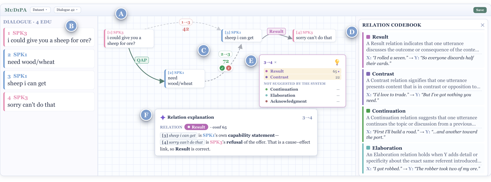
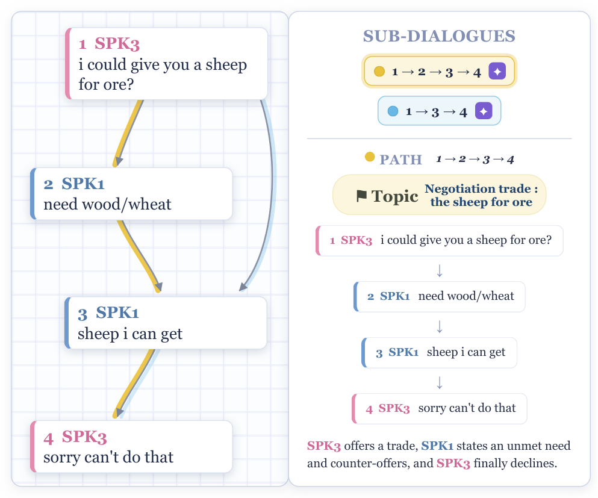
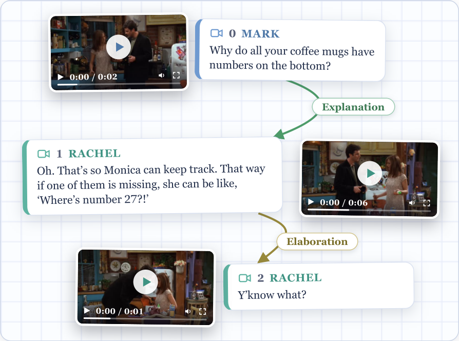

# MuDiPA — Multi-party Dialogue Parsing Assistant

A web-based, human-in-the-loop platform for **discourse-graph annotation** in
multi-party dialogues (SDRT). Annotators draw discourse arcs, label relations,
and group threads, aided by two pluggable AI backends:

- a **suggestion engine** — a discourse parser (DDPE) that proposes
  confidence-ranked attachments and relation labels;
- a **reasoning engine** — an LLM (Claude) that generates on-demand
  natural-language rationales for candidate links and relation labels.

<h2 align="center">▶️ <a href="https://c433-193-205-162-89.ngrok-free.app/">Try the live MuDiPA demo</a></h2>
<p align="center"><sub>Live-tunnelled instance · if it is unreachable, run it locally via <a href="#quick-start">Quick&nbsp;start</a>.</sub></p>

<p align="center">
  <video src="video/mudipa_demo_full.mp4" controls muted width="90%"></video>
</p>
<p align="center"><sub>▶ 2.5-min screencast — if the player does not load, <a href="video/mudipa_demo_full.mp4">open / download the video</a>.</sub></p>

<p align="center"></p>

<p align="center"><em>The MuDiPA interface: the dialogue list, the discourse graph with parser-suggested
arcs and relation labels, the top-K relation ranking, and the reasoning engine's rationale (right).</em></p>

<p align="center">
  
  &nbsp;&nbsp;
  
</p>
<p align="center"><em>Sub-dialogue navigation (left) and the synchronized multimodal view (right).</em></p>

> **Availability.** MuDiPA is open-source and self-hostable — the full source is in this
> repository and runs locally in a few commands (see **[Quick start](#quick-start)**). A
> ready-to-run snapshot can be downloaded from GitHub via *Code ▸ Download ZIP* or a release
> tarball; the annotation UI needs no special hardware.
>
> 📹 **Screencast (≤ 2.5 min):** [`video/mudipa_demo_full.mp4`](video/mudipa_demo_full.mp4)
> &nbsp;·&nbsp; 🔗 **Live demo:** <https://c433-193-205-162-89.ngrok-free.app/> _(live-tunnelled instance; if unreachable, run locally via Quick start below)._

---

## Quick start

```bash
pip install -r requirements.txt
cp .env.template .env          # optional: add a Claude token to enable the reasoning engine
python app/app.py              # http://localhost:5050  (add --no-auto-load to skip local LLM autoload)
```

Open the URL and sign in. Login codes starting with **DEV / EXP / ADMIN** enter
**free-exploration mode** (dataset picker, split selector, and the **⬆ Upload**
button); any other code follows the guided study flow. Default study password:
`catan-study` (override via `MUDIPA_STUDY_PASSWORD`).

### Suggestion engine (discourse parser, separate GPU process)

The parser runs as its own service on port `8092` and needs a torch/transformers
environment (not in `requirements.txt`):

```bash
pip install torch transformers peft huggingface_hub
python servers/suggestion_engine.py   # http://127.0.0.1:8092
```

`suggestion_engine.py` downloads the base model on first use (needs `HF_TOKEN`); LoRA
adapters live under `ext/DDPE/{STAC,Molweni}`. The tool runs without the parser —
you simply lose live suggestions.

### Reasoning engine (Claude)

Set `CLAUDE_CODE_OAUTH_TOKEN` **or** `ANTHROPIC_API_KEY` in `.env`, or log in with
the local Claude CLI. Without a credential the reasoning engine is disabled and
the rest of the tool still works.

---

## Datasets

The picker exposes the corpora whose data is present on disk: **STAC**,
**Molweni**, and the multimodal **DraDDP** (Friends/MELD) and **MODDP**. The
corpora are **not bundled** (they carry their own licenses) — obtain them from
their sources and place them under `data/` as configured in `app/corpora.py`.

### Upload your own dialogues

Use the **⬆ Upload** button (free-exploration mode) to load a `.json` or `.jsonl`
file. One dialogue per record, in the MuDiPA schema:

```json
{"id": "my_dialogue_1",
 "edus": [
   {"speaker": "Alice", "text": "anyone have wheat?"},
   {"speaker": "Bob",   "text": "nope sorry"}
 ],
 "relations": [{"type": "Question-answer_pair", "x": 0, "y": 1}]}
```

- `edus` is **required** (a non-empty list); each EDU needs a `text` (and
  optionally a `speaker`). A plain list of strings is also accepted.
- `relations` is **optional** — omit it to annotate a pre-segmented dialogue from
  scratch. Each relation is `{type, x, y}` with integer EDU indices.

`.json` may be a single dialogue object or a list; `.jsonl` is one dialogue per
line. Uploaded corpora appear immediately in the dataset picker.

---

## Layout

```
app/
  app.py            Flask backend (annotation API, study auth, upload, SQLite logging)
  corpora.py      dataset configs + dialogue loaders
  relations.py      SDRT relation set, definitions, normalization
  relation_rules.py SDRT structural rules (right-frontier constraint, …)
  engines.py        pluggable suggestion/reasoning engine registry
  static/index.html single-file React 18 frontend
servers/
  suggestion_engine.py     DDPE discourse parser service (GPU)
data/               corpora, annotations, uploads (obtain corpora separately)
```

## Configuration (env vars)

- `CLAUDE_CODE_OAUTH_TOKEN` / `ANTHROPIC_API_KEY` — enable the reasoning engine (optional).
- `MUDIPA_STUDY_PASSWORD` — shared study login password (default `catan-study`).
- `MUDIPA_SECRET_KEY` — Flask session secret (set a real value in production).
- `HF_TOKEN` — Hugging Face token for the `suggestion_engine` base-model download.
- `PORT` — overrides the Flask port (default 5050).

See `.env.template`. **Do not commit `.env`** (it is gitignored).

## Evaluation

MuDiPA was evaluated in a within-subjects user study in which annotators completed STAC
dialogues with and without assistance. Assistance improves relation-labelling F$_1$ and
inter-annotator agreement and lowers perceived workload (NASA-TLX), at a modest cost in
annotation time; the reasoning engine reliably flags mislabelled relations. Full results
are reported in the paper, and the analysis scripts and aggregates live under `analysis/`.

## Citation

```bibtex
@article{mudipa2026,
  title  = {MuDiPA: A Human-in-the-Loop AI-Assisted Platform for Discourse-Graph
            Annotation in Multi-party Dialogues},
  author = {De Santis, Laura and Cimino, Gaetano and Feldhus, Nils and Carenini, Giuseppe and Deufemia, Vincenzo},
  note   = {Submitted to EMNLP},
  year   = {2026}
}
```

## License

Code is released under the [MIT License](LICENSE). Bundled/downloaded corpora and
model adapters retain their own licenses.
